# 🏢 Sridhar ERP

<p align="center">
  
  
  
  
  
  
  
  
</p>

A metadata-driven, event-sourced, **no-code ERP platform**. Every ERP module — from CRM to Manufacturing to full industry suites — is JSON configuration on top of one shared engine. There is no separate codebase per module: only config.

**Author / Developer: Sridhar**

---

## 🌍 One Platform — Every Organization

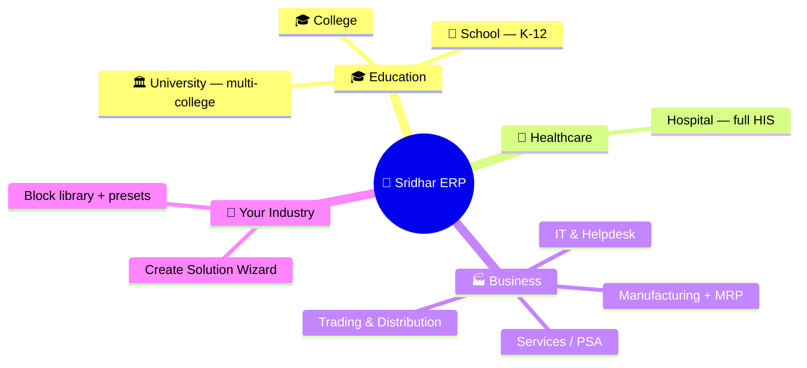

Install a ready-made industry suite in **one click**, or compose your own with the Solution Wizard — every package below is pure configuration on the same engine, so audit, workflows, approvals, SLA, reporting, portals, and row-level security apply to all of them automatically.

---

## 🏫 Schools — What a K-12 School Can Do

> **92 entities · 18 roles · 27 workflows · 42 reports · 13 dashboards · 13 KPIs · 48 parent/student portal grants** — one install turns a blank workspace into a complete school system.

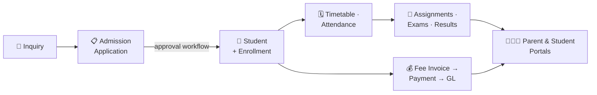

| Module | What you can do |
|---|---|
| 📩 **Admissions & Enrollment** | inquiries → applications → approval workflow that auto-creates the student + admission letter; withdrawals, status history |
| 📚 **Academics** | academic years, terms, classes, subjects, curricula, timetables, lesson plans, assignments, exams & results |
| 🕐 **Attendance & Behaviour** | daily attendance with corrections, behaviour incidents, disciplinary actions, safeguarding records, at-risk indicators & alerts |
| 💰 **Fees & Finance** | fee structures, invoices, payments, discounts, waivers, refunds, scholarships, installment plans — **ledger-ready GL postings** out of the box |
| ❤️ **Welfare & Health** | medical profiles, allergies, medications, vaccinations, health screenings, nurse visits, counselling, IEPs & learning support |
| 🏅 **Activities & Houses** | clubs, houses, sports, competitions, awards, student leadership & elections, community service |
| 🚌 **Operations** | transport routes, hostels, library & book loans, meal plans, gate passes, ID cards, visitor logs, parent meetings |
| 👨‍👩‍👧 **Portals** | parents and students see *their own* data only — a separate auth realm with 48 scoped grants, isolation enforced server-side |

**Who uses it:** principal · vice-principal · registrar · teachers & class teachers · counsellor · school nurse · librarian · accountant · transport/hostel managers · sports & club coordinators · auditor — each with a scoped role and their own dashboard.

---

## 🎓 Colleges — What a College Can Do

> **107 entities** across nine certified phases — academic core through executive analytics.

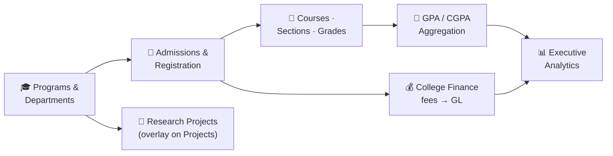

| Area | What you can do |
|---|---|
| 🎓 **Academic Core** | programs, departments, courses, sections, faculty assignments, registration with guard rules (prerequisites, capacity, eligibility) |
| 🧮 **Grades & Aggregation** | grade entry → automatic GPA/CGPA aggregation (7 configurable aggregation pipelines) |
| 💰 **Finance** | tuition & fee lifecycle wired into the platform General Ledger |
| 🏕️ **Campus Operations** | facilities, services, student life — plus the student portal |
| 🔬 **Research** | research projects, grants and scholarly metadata as an **overlay** on the frozen Projects platform (no duplicate PM module) |
| 📊 **Executive Analytics** | leadership dashboards & KPIs configured over the frozen analytics platform |
| 🛡️ **Hardening** | 28 data-integrity business rules + 5 SLA policies certified in the final phase |

---

## 🏛️ Universities — What a University Can Do

> **108 entities · 57 workflows · 18 roles · 54 reports · 44 KPIs · 15 dashboards · 22 portal grants** — the largest education package, built for multi-college institutions.

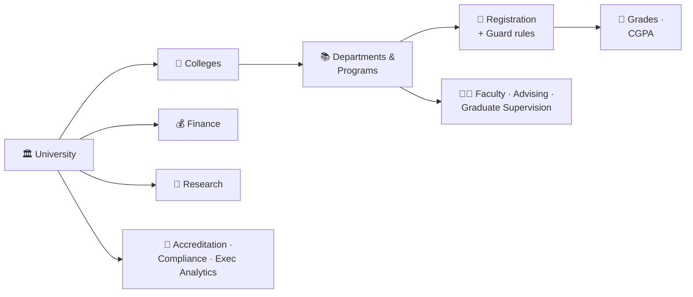

| Area | What you can do |
|---|---|
| 🏛️ **Multi-College Structure** | university → colleges → departments → programs, all hierarchically modeled |
| 📝 **Registration & Guard** | course registration with prerequisite/capacity/eligibility enforcement |
| 📖 **Grades** | grade lifecycle with CGPA aggregation |
| 👩‍🏫 **Faculty** | faculty workload, academic advising, graduate committee & thesis supervision |
| 💰 **Finance & Campus Ops** | institutional finance on the shared GL + campus operations |
| 🔬 **Research** | research programs as an overlay on the Projects platform |
| 🏅 **Governance** | accreditation tracking, compliance, executive analytics scorecards |
| 🛡️ **Enterprise Hardening** | 28 block-save integrity rules + 6 SLA policies |

---

## 🏥 Hospitals — What a Hospital Can Do

> **92 entities across 13 phases (H1–H13)** — a functionally complete Hospital Information System, 100% rendered by the generic runtime.

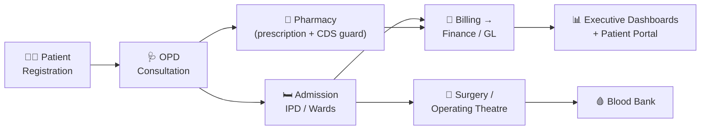

| Area | What you can do |
|---|---|
| 🧑‍⚕️ **Patient Management** | registration, demographics, OPD visits, referrals |
| 🩺 **Clinical** | consultations, diagnoses, clinical documentation |
| 💊 **Pharmacy** | unified prescription (order + script) with clinical-decision-support guard rules; pharmacy stores run on the platform Inventory engine |
| 🛏️ **In-Patient (IPD)** | admissions, wards, bed management |
| 🔪 **Surgery** | operating theatre scheduling and surgical records |
| 🩸 **Blood Bank** | donor / unit lifecycle |
| 🧾 **Billing** | hospital billing flowing straight into the platform Finance/GL |
| 📊 **Executive & Portal** | executive read/export dashboards + patient portal via scoped grants (zero duplicate entities) |

---

## 🏭 Businesses — What Any Company Can Do

The core ERP engines cover the classic end-to-end business processes:

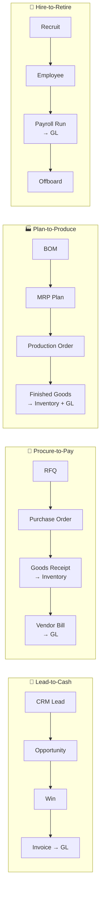

| Engine | Highlights |
|---|---|
| 💰 **General Ledger & Accounting** | balanced journals, posting rules, standard chart, auto-provisioning on install |
| 📦 **Inventory** | FIFO / weighted-average / standard costing, row-locked stock levels, immutable movements |
| 🛒 **Procurement** | RFQ → PO → Goods Receipt → Vendor Bill with gapless numbering and GL integration |
| 🤝 **CRM** | leads → opportunities → win/lose lifecycle, accounts, contacts, activities |
| 👥 **HR / HCM** | 28 business objects across 9 modules — recruitment to offboarding, leave balances, performance |
| 💵 **Payroll** | formula components, proration, segregation of duties (creator ≠ approver ≠ poster), country adapters, GL posting |
| 🏗️ **Assets (EAM)** | depreciation schedules (straight-line / declining / double-declining), disposals, valuation snapshots |
| 📋 **Projects / PSA** | CPM critical path, EVM (CPI/SPI), timesheets, cross-module cost rollup |
| 🎧 **Helpdesk / ITSM** | SLA-attached tickets, deterministic assignment, escalation, knowledge base, CSAT |
| 🏭 **Manufacturing + MRP** | multi-level BOM explosion, production orders, OEE, quality & NCR, lot traceability |
| 🏦 **Treasury** | cash management and the Bank Reconciliation workbench |
| 📈 **Financial KPIs** | one governed KPI library — CEO/CFO/COO scorecards with thresholds and trends |

---

## 🧙 Your Industry — Build It Without Code

Don't see your vertical? The **Create Solution Wizard** composes one from the block library:

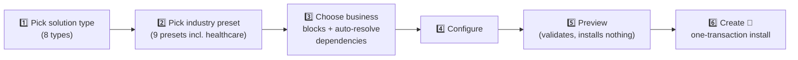

One transaction provisions the **full stack**: entities with real PostgreSQL tables, forms, views, workflows, business rules, reports, dashboards, notification templates, roles & permissions, navigation, and a home screen. Uninstall is just as clean.

---

## 🗃️ Complete Module Catalog — 83 packages, one engine

Every Django app in `backend/apps/`, grouped by layer:

<details open>
<summary><b>🧠 Platform Core (14)</b> — the no-code engine itself</summary>

| Package | What it does |
|---|---|
| `core` | base models & mixins — UUID PKs, timestamps, soft-delete, audit, `TenantModel` |
| `accounts` | users, JWT (RS256), TOTP MFA, Passkeys/WebAuthn, sessions, API keys, OAuth |
| `tenancy` | workspaces, tenant middleware, RLS context, orgs/departments/teams/branches |
| `metadata` | `EntityDefinition` · `FieldDefinition` · forms · modules — the no-code heart |
| `physical_tables` | DDL engine — generates a real PostgreSQL table (+ index + RLS) per entity |
| `schema_registry` | every schema change versioned, with rollback |
| `records` | generic CRUD & data-access layer over the generated tables |
| `relationships` | FK & many-to-many links between entities |
| `nql` | Nexus Query Language — Lark parser + compiler to parameterized SQL |
| `permissions` | RBAC + ABAC engine, field-level permissions & masking |
| `eventstore` | append-only domain events + command bus |
| `projections` | read-model projectors + rebuild |
| `system_entities` | System-Entity Adapter — native engine models rendered by the generic runtime |
| `personalization` | per-user preferences & appearance |

</details>

<details open>
<summary><b>⚙️ Automation & Process (8)</b> — everything that runs by itself</summary>

| Package | What it does |
|---|---|
| `workflows` | graph workflow engine — triggers, 27 step executors, Celery async, schedules |
| `approvals` | multi-level approvals, quorum (any/all), timeouts, escalation |
| `sla` | SLA policies, business-hours calendars, warning/breach detection |
| `rules` | business rules — NQL conditions → `set_field` / `block_save` on save |
| `computed` | computed fields — safe-AST formulas, rollups, cycle detection |
| `guards` | declarative cross-record validation framework (prerequisites, capacity…) |
| `numbering` | gapless document numbering (invoices, POs, admission numbers…) |
| `aggregation` | declarative cross-record aggregation & persistence (GPA/CGPA pipelines…) |

</details>

<details open>
<summary><b>💬 Collaboration, Content & Experience (13)</b> — how people work together</summary>

| Package | What it does |
|---|---|
| `activity` | activity feed projection, threaded comments, @mentions |
| `notifications` | templates + multi-channel delivery (email/in-app/webhook/SMS) + WebSocket push |
| `realtime` | live WebSocket streams — records, workflows, dashboards, presence |
| `documents` | file storage (local/S3), versioning, signed URLs, async AV scan, folders |
| `document_templates` | record-bound PDF document templates (headers, line items) |
| `email_templates` | locale-aware email templates with server-rendered preview & test-send |
| `search` | full-text search — PostgreSQL tsvector + GIN, ranked cross-entity |
| `tagging` | tags on any record |
| `views_saved` | saved views — persisted filters/sorts per entity |
| `public_forms` | unauthenticated form submissions with honeypot + rate limiting |
| `portal` | external portal realm — separate auth, server-enforced row scoping |
| `branding` | white-label — logo, colors, custom CSS (sanitized), SMTP config |
| `localization` | locales, timezones, currencies, translations, entity label overrides |

</details>

<details open>
<summary><b>📊 Analytics & Insight (7)</b> — seeing what's happening</summary>

| Package | What it does |
|---|---|
| `reporting` | NQL-driven reports, pivots, snapshots, dashboards, CSV/XLSX/PDF export |
| `analytics` | central KPI registry — definitions, thresholds, scorecards, alerts, trends |
| `financial_kpis` | the governed financial-ratio KPI library with AI-readiness metadata |
| `financial_reports` | statutory financial statements over the ledger |
| `audit` | full audit trail API + per-record timeline |
| `lineage` | data lineage graph — upstream/downstream impact of any object |
| `admin_views` | tenant health metrics — usage, latency, error rates, storage |

</details>

<details open>
<summary><b>💰 Financial Platform (13)</b> — one ledger, many engines</summary>

| Package | What it does |
|---|---|
| `ledger` | General Ledger — balanced journals, posting rules, chart of accounts, GL bus |
| `budgets` | budgeting & budget control |
| `cash` | cash management |
| `treasury` | treasury + the Bank Reconciliation workbench |
| `taxes` | tax configuration & calculation |
| `currency` | multi-currency & exchange rates |
| `dimensions` | financial dimensions (cost center, project…) with posting validation |
| `consolidation` | multi-entity consolidation + worksheet workbench |
| `revenue` | deferred-revenue recognition |
| `settlement` | payment allocation — matching payments/credits to invoices |
| `credits` | credit notes — issue & void |
| `collections_engine` | dunning — due schedules, reminders, collections |
| `companies` | legal entities / multi-company structure |

</details>

<details open>
<summary><b>🏭 ERP Business Engines (9)</b> — the classic ERP modules</summary>

| Package | What it does |
|---|---|
| `crm` | leads → accounts/contacts → opportunities → win/lose |
| `hr` | HCM — 28 objects across 9 modules, recruitment to offboarding |
| `payroll` | payroll runs with segregation of duties, formulas, country adapters, GL posting |
| `inventory` | items, warehouses, FIFO/weighted-avg/standard costing, immutable movements |
| `procurement` | RFQ → PO → Goods Receipt → Vendor Bill, gapless numbers, GL hooks |
| `manufacturing` | BOM explosion, MRP, production orders, OEE, quality/NCR, traceability |
| `assets` | EAM — depreciation (3 methods), disposals, valuation snapshots |
| `projects` | PSA — CPM scheduling, EVM, timesheets, cross-module cost rollup |
| `helpdesk` | ITSM — SLA-attached tickets, assignment, escalation, KB, CSAT |

</details>

<details open>
<summary><b>🛍️ App Platform & Distribution (5)</b> — how solutions are built & shipped</summary>

| Package | What it does |
|---|---|
| `studio` | Applications, Home Layouts, Navigation — the "build an app" layer |
| `solution_templates` | solution catalog + one-transaction installer + Create Solution Wizard |
| `marketplace` | plugin browse/install/upgrade/rollback with validated manifests |
| `process_catalog` | global business-process blueprint catalog |
| `packaging` | package platform — dependencies, versioning, migrations, SDK, registry |

</details>

<details open>
<summary><b>🛡️ Governance & DevOps (10)</b> — running it safely</summary>

| Package | What it does |
|---|---|
| `config_vcs` | git-like config versioning — commit, diff, branch, 3-way merge, rollback |
| `environments` | DEV→TEST→UAT→PROD promotion packages with approvals & rollback |
| `feature_flags` | flags with workspace/role/user overrides + deterministic %-rollout |
| `dependency` | impact analysis — safe-delete checks, change previews, risk scoring |
| `certification` | enterprise certification runner — integration registry, health, E2E simulations |
| `backups` | encrypted backups, PITR restore (always into an isolated target), retention |
| `recyclebin` | deleted-record browser — restore, purge, auto-purge |
| `staging` | data import (CSV/XLSX pipeline) & export jobs with signed downloads |
| `integrations` | outbound HMAC-signed webhooks, inbound webhooks, HTTP connectors, OAuth apps |
| `ops` | operational probes — `/readyz` dependency health checks, request-ID correlation |

</details>

<details open>
<summary><b>🎓 Industry Packages (4)</b> — complete verticals, pure config</summary>

| Package | What it does |
|---|---|
| `school` | K-12 School Management — 92 entities, the frozen reference package |
| `college` | College Management — 107 entities across 9 certified phases |
| `university` | University Management — 108 entities, multi-college, 57 workflows |
| `hospital` | Hospital Information System — 92 entities across 13 phases |

</details>

---

## 🗺️ System Architecture

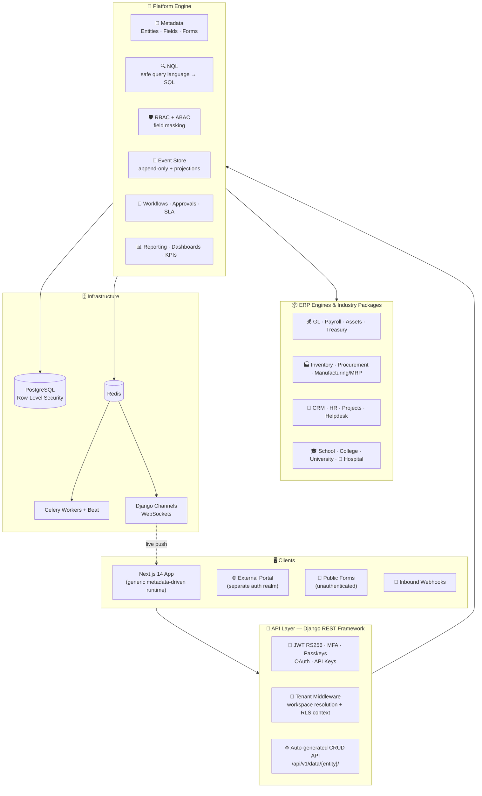

## 🔁 Event-Sourcing Flow

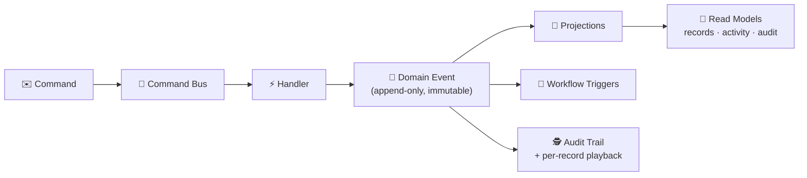

## 🛡️ Security Model — Defense in Depth

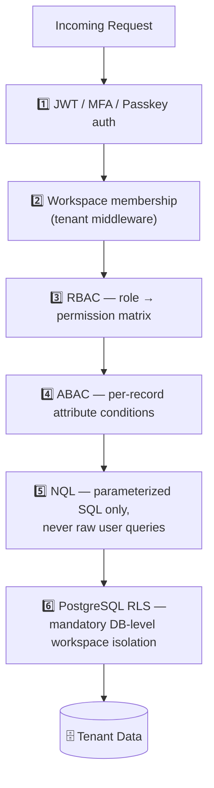

Every tenant table carries a PostgreSQL Row-Level Security policy — even if every application layer above it failed, the database itself refuses cross-workspace reads.

## 🧬 No-Code Pipeline — from click to real table

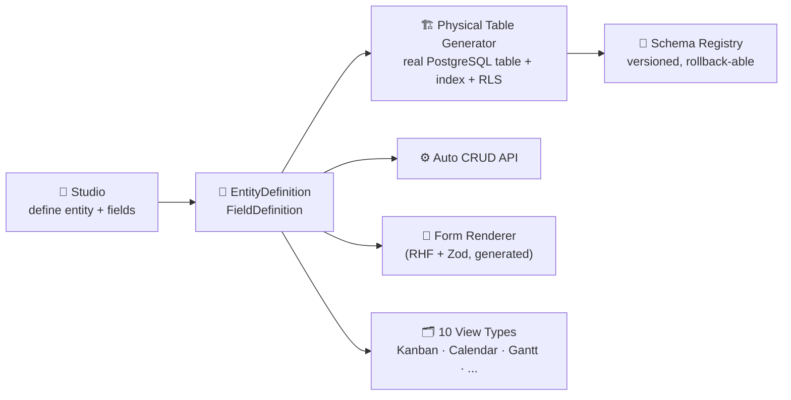

---

## 🧰 Platform Capabilities

| | | |
|---|---|---|
| 🔄 Workflow engine (graph executor, 27 step types) | ✅ Approvals (multi-level, quorum, timeout) | ⏱️ SLA engine + business-hours calendars |
| 🔔 Notifications (email/in-app/webhook/SMS + WebSocket) | 📊 Reports, dashboards & KPI analytics | 📤 CSV / XLSX / PDF export |
| 🔎 Full-text search (tsvector + GIN) | 📁 Document management (versions, signed URLs, AV scan) | 📥 Data import/export pipeline |
| 🔗 Integrations & HMAC-signed webhooks | ♻️ Recycle bin & data lineage | 🌿 Config version control (branch/merge/rollback) |
| 🚀 Environment promotion (DEV→TEST→UAT→PROD) | 💾 Backups & point-in-time restore | 🛍️ Marketplace & solution templates |
| 📝 Public forms (honeypot + rate limit) | 📱 PWA + offline outbox | 🌍 i18n with RTL support |

## 🧱 Tech Stack

| Layer | Technology |
|---|---|
| ⚙️ Backend | Django 5.2 LTS + Django REST Framework |
| 🖥️ Frontend | Next.js 14 (App Router, TypeScript) |
| 🗄️ Database | PostgreSQL (SQLite for tests) |
| 📨 Queue | Celery + Redis |
| ⚡ Realtime | Django Channels + Redis |
| 🔐 Auth | JWT (RS256), TOTP MFA, Passkeys/WebAuthn, Google OAuth, API keys |

## 📂 Repository Layout

```
E:\erp\
├── backend/              # Django project — 83 apps (full catalog above)
│   ├── config/           #   settings, urls, asgi, celery
│   └── apps/             #   engine (metadata, nql, permissions, eventstore, ...)
│                         #   + ERP engines (ledger, inventory, payroll, ...)
│                         #   + industry packages (school, college, university, hospital)
├── frontend/             # Next.js app — generic runtime + studio builders
├── keys/                 # RS256 JWT keypair (never commit)
└── PROJECT_HANDBOOK.md   # full architecture, constraints & phase history
```

## 🚀 Getting Started

### Backend

```bash
cd backend
pip install -r requirements.txt
python manage.py migrate
python manage.py runserver          # API at http://localhost:8000

# Tests (SQLite, no PostgreSQL needed)
python -m pytest --tb=short -q
# Tests against PostgreSQL
python -m pytest --ds=config.settings.test_pg

# Background workers
celery -A config.celery worker -l info
celery -A config.celery beat -l info
```

### Frontend

```bash
cd frontend
npm install
npm run dev                         # http://localhost:3000

npm run test                        # vitest suite
npm run build                       # production build
```

### Install an industry package

```bash
# In the app: Solutions → pick a package (e.g. School Management) → Preview → Install
# Or via API (owner/admin, with X-Workspace-Slug):
POST /api/v1/solution-templates/{template_id}/install/
```

Environment configuration lives in `.env` (see `PROJECT_HANDBOOK.md` §4 for the full reference).

## ✅ Quality Gates

- 🧪 Thousands of automated tests, run green on **both** SQLite and PostgreSQL before any phase is declared done
- 🧹 `ruff check .` clean project-wide · `manage.py check` zero issues
- 🖥️ Frontend: typecheck + lint (0 warnings) + vitest + production build green every phase
- 🏅 14-gate full-stack certification standard for every module and package

## 📚 Documentation

- 📖 **`PROJECT_HANDBOOK.md`** — the single source of truth: architecture, hard constraints, conventions, and the complete phase-by-phase build history
- 📄 `PHASE_*_REPORT.md` — detailed report for every completed phase
- 🏅 `ERP_CERTIFICATION_REPORT.md` — enterprise certification results
- 🏫 `backend/apps/school/README.md` — reference industry package

---

## 👤 Author

**Sridhar** — sole author and developer of Sridhar ERP.
